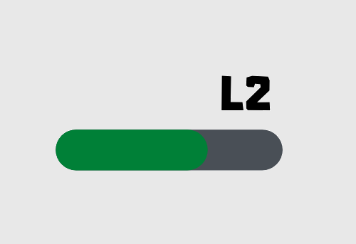

# LevelTwo

LevelTwo is a software engineering project part of our Bachelor's Degree.  
It is a small maze game, nothing too fancy.

It aims at exploring:

- The Python programming language
- Video game development
- Graphical interfaces
- Data structures
- Database manipulation
- Some form of Artificial Intelligence, especially pathfinding and decision trees
- Procedural generation

## Includes

- Comprehensible, object-oriented architecture
- Flexible system
- Hexagonal ([bestagonal](https://youtu.be/thOifuHs6eY)) maze
- Live editor
- Pathfinding algorithms
- The possibility to solve the maze manually
- Replay feature

## Team
- [Lilian BOULARD](https://lilian.boulard.fr/)
- Julien CHIGOT
- Rafaël METAYER

## Usage

To clone the git repository, use the git command

    git clone https://github.com/LilianBoulard/LevelTwo

Then, `cd` into the `LevelTwo` directory, and install the requirements with 

    pip install -r requirements.txt

*Note: we advise you use a virtual environment for this*

To insert the initial values into the database, such as default objects and levels, launch ``insert_all.py``.

Finally, open ``play.py`` to play and ``level_editor.py`` to edit/create levels !

Note: keyboard controls as well as mechanics are explained in ``docs/gameplay.md``.

## Organization

Trello board : https://trello.com/b/lN0r08OH/leveltwo
